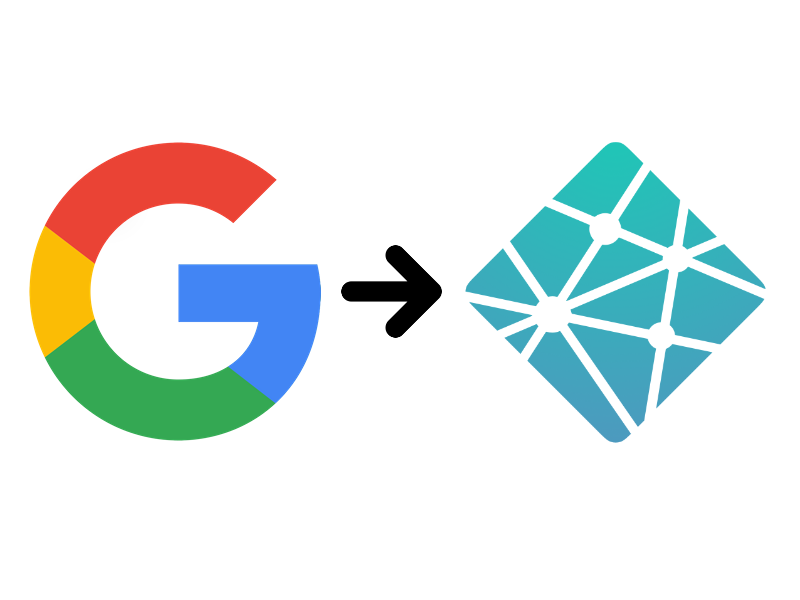
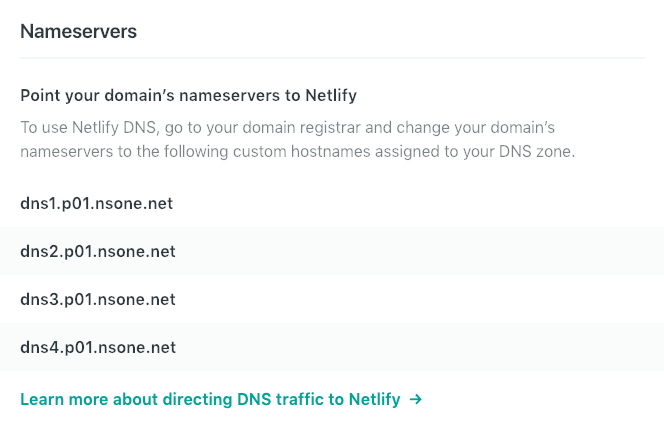
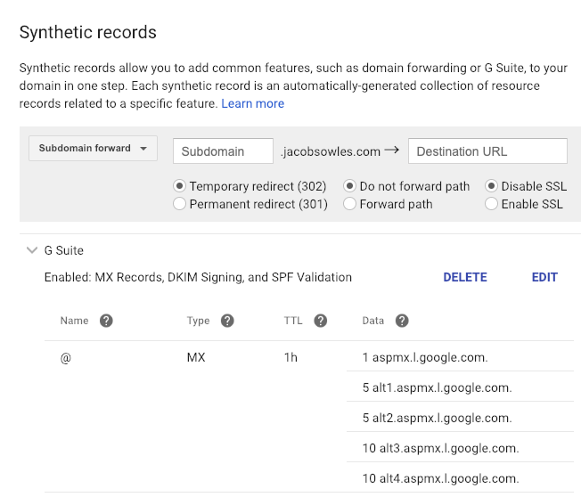
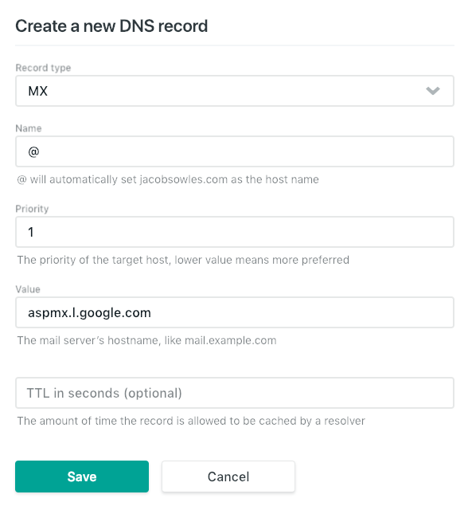
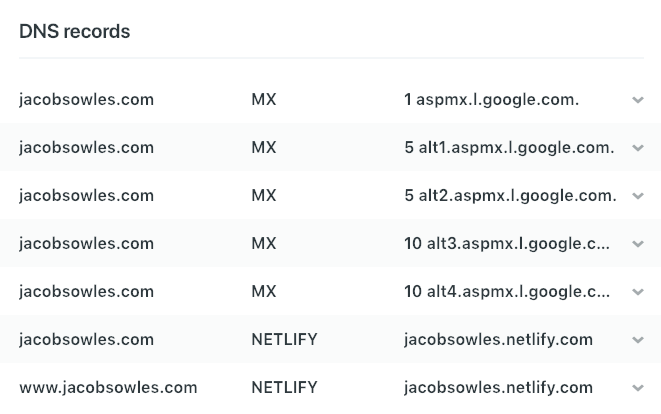

I migrated jacobsowles.com to Netlify and received a scary message from Google Domains when following Netlify's deployment guide.

According to this message, my email service is disabled. Not ok.

One option is to just transfer the domain to Netlify and let them handle everything. This is the most seamless solution, but I use G Suite for this domain and need to keep that system intact, so transferring the domain isn't an option.

But fear not. The rest of this post will show how I deployed my site to Netlify while keeping G Suite up and running.

# Step 1: A deployment like any other

Netlify has a great [deployment guide](https://www.netlify.com/blog/2016/09/29/a-step-by-step-guide-deploying-on-netlify/ 'Netlify deployment guide'), and that's what I followed to get my site up and running-. It will walk you through setting up the site configuration, linking your version-control tool of choice, and setting up automated builds and deploys.

# Step 2: Update nameservers

Since your domain is registered with Google (and you want to keep it that way), you'll need to update your Google Domain nameservers to point to Netlify.

Grab the list of Netlify nameservers from your DNS Settings page here: https://app.netlify.com/account/dns/yoursite.com.

Now head over to your Google Domains DNS Settings page (https://domains.google.com/m/registrar/yoursite.com/dns), select the **Use custom nameservers** radio button, and copy-paste your Netlify nameservers.

Now you've got your domain pointing to Netlify, but Google has a problem with this. You'll see the scary yellow warning from the top of this post in your Google DNS settings. Your Gmail is currently broken, but don't worry. We can rebuild it. We have the technology.

# Step 3: Set up MX Records

[According to Wikipedia](https://en.wikipedia.org/wiki/MX_record 'Wikipedia - MX Record'), a mail exchanger record (MX record) specifies the mail server responsible for accepting email messages on behalf of a domain name. Google had this all set up for us, but since we're now using Netlify for our DNS settings, we lose all of our Google DNS settings, which includes the MX records.

To fix this, first grab your MX records from your Google DNS page. You'll find these in the **Synthetic records** box by expanding the **G Suite** section.

Now head back over to your Netlify DNS settings and click **Add new record** in the **DNS records** section. This will bring up a modal window where you'll copy-paste the MX record information you got from Google.

Fill out the form like this:

A couple of notes:

Priority should be set to the number in front of the MX record hostname. Google's DNS settings page concatenates this information together, like **1 aspmx.l.google.com**, so you'll want to split that information up when putting it into this form.

Your Value field may be different than mine, so make sure to copy-paste from your Google DNS settings.

Hit **Save** and repeat the process for your remaining MX records.

# Step 4: Test

At this point, your Netlify DNS records should look something like this:

To make sure everything's set up properly, navigate to all four permutations of your site:

1. http without www
2. http with www
3. https without www
4. https with www

If any of those don't work, wait a few minutes and try again. DNS settings can take up to 24 hours to propagate (although mine were up and ready to go in about 10 minutes).

Now send yourself an email to your G Suite address to make sure you're receiving email properly. Once again, if it doesn't go through, wait for a bit and try again.

Once those tests check out, you're done.

_Join the conversation about this post [over at Medium](https://medium.com/@jacobsowles/how-to-deploy-a-google-domains-site-to-netlify-c62793d8c95e 'Medium - How to Deploy a Google Domains Site to Netlify')._
