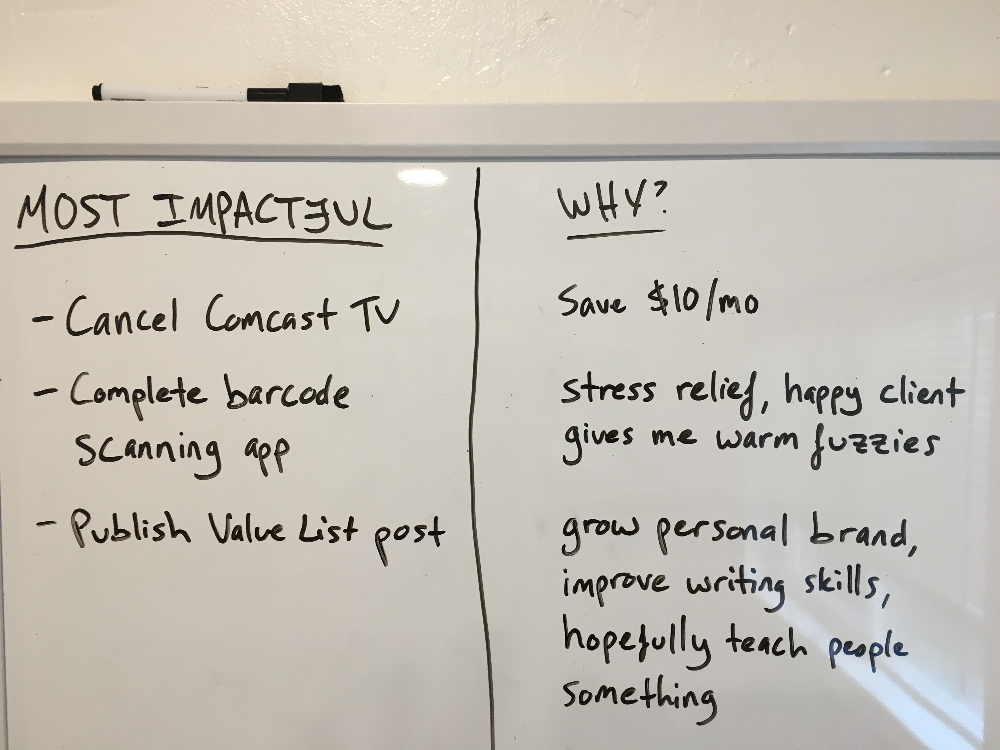

Measuring productivity by the number of tasks completed is essentially the same as measuring it by the number of hours worked, and we know better than that. Not all tasks are created equal, and it's incredibly easy to manufacture work for ourselves that doesn't actually provide much (if any) concrete value.

Case in point: a while back, I started my day like I always did: by opening up my giant todo list and immediately regretting it. Based on some advice I'd read or heard in so many productivity publications, I picked out an easy task to knock out quickly in hopes of building some momentum that would help me move on to bigger and more complex tasks.

A few minutes later, I finished up my first task but still didn't feel like biting off something more significant, so I moved on to more low-hanging fruit. After completing that task, I was picking up steam, but not the kind that would propel me into quality, meaningful work. I was now getting a rush from simply completing tasks, regardless of what they were.

Fast-forward to the end of the day. I'd knocked a bunch of tasks off of my list. I felt incredibly productive, yet there was a lingering stress looming over me that I couldn't shake. What I needed to get done that day was a working prototype of a client project. What I actually got done was a pruned Google Drive, a nicely consolidated stack of paper towel rolls, a better storage mechanism for my dog poop bags, and an automated system for organizing scanned IKEA receipts.

Do those things have value? Yes, a little. I'm actually quite happy with the receipt processing system in particular, but its value is only realized maybe once per year when I buy something from IKEA. And yes, those paper towel rolls look like a finely crafted grocery store display. But did I wake up that morning with a sense of angst because those things weren't done? No. The client prototype, on the other hand...

Many of those tasks weren't even on my todo list to begin with. So not only was I not completing truly valuable tasks, I was adding more quasi-meaningless work to my already full plate. Finishing and sending out that client prototype, however, would have led to an immediate, significant reduction in stress.

The takeaway is this: measure your productivity in value added, not tasks completed.

But how?

My system consists of two parts: a Triage List and a Value List.

## The Triage List

<small>_The Triage List: a pile of stuff that you'll later evaluate and harvest from to populate your Value List. Photo by [Louis Hansel](https://bit.ly/2RPE5Pf 'Louis Hansel') on [Unsplash](https://bit.ly/2FIHlq7 'Unsplash')._</small>

---

The Triage List is where I dump anything and everything that I think I might need to get done at some point. Notice all of the qualifiers in that statement.

> "Anything and everything”

Don't be picky about what goes into your Triage List. There should be a free-flowing connection from your brain to your Triage List. You're not committed to anything that ends up there. The point is just to empty your brain and free up space for more important things.

> "I think I might need to get done”

Some tasks just aren't worth doing. If I never stack paper towel rolls again in my life, I don't think I'll be any worse off. But don't worry about that right now. Just dump it into your Triage List and understand that you may end up deleting it without completing that task.

> "At some point”

Don't worry about due dates, time estimates, or any other temporal metric for now. Just put the task in the triage list and move on.

As far as where your Triage List should live, it doesn't really matter. I've used [Todoist](https://todoist.com/ 'Todoist'), [OmniFocus](https://www.omnigroup.com/omnifocus/ 'OmniFocus'), [Evernote](https://evernote.com/ 'Evernote'), and even just the Mac Notes app. There's no need to organize your Triage List, and the only extra information tasks need is (sometimes) a due date and any relevant notes. That makes basically any tool a viable option to house your Triage List.

If you decide to use a non-digital system, make sure you can easily remove it from sight. Once you've populated your Value List, you shouldn't be looking at your Triage List again until the next day. So paper and pen is fine, whereas a whiteboard mounted on the wall is not.

I alphabetize my tasks because my brain won't let me not do that, but I have a keyboard shortcut that takes care of it for me, so there's no extra time involved. The bottom line is that you should spend as little time in your Triage List as possible. Time spent managing your list is time not spent doing things _on_ the list.

## The Value List

<small>_Hand-selecting a few tasks from the Triage List to be added to the Value List. Photo by [Clem Onojeghuo](https://bit.ly/2VKe3Mo 'Clem Onojeghuo') on [Unsplash](https://bit.ly/2FIHlq7 'Unsplash')._</small>

---

The Value List is a small subset of your Triage List that consists of the tasks you intend to complete that day that will make the greatest positive impact on your life. If you complete the tasks on your Value List, you should be able to reflect on that day and feel like you're in a better place than you were that morning. If you complete your Value List and _don't_ feel like that, you should consider revisiting your definition of "valuable”.

But the Value List isn't just a collection of highest priority tasks. The key element of this list is that every item on it has a statement of value that goes along with it. This statement is your motivation for completing the task. This is your chance to explicitly define the positive benefit you will receive by completing the task. For example, here's my actual Value List for today:

Notice a few things here. First, the tasks don't have to be complex or time-consuming. Canceling Comcast TV, for example, takes very little time or energy, but it's still valuable to me because I can reallocate that $10 per month to something I actually care about. Also, value statements don't have to be long or deeply philosophical. They should be specific, though, so "save $10/mo” is better than something like "\$\$\$”.

Second, make sure to capture the value that _you_ get out of the task. The barcode scanning app I'm working on is for a client, so it would be very easy to write "because I'm required to” for the value statement. But that's not helpful. The project has been dragging on longer than I'd like, so knocking it out would immediately reduce my stress levels by a significant amount. Additionally, I love delivering a great product to a client. They're happy, my boss is happy, I'm happy. That and the stress relief combined make this a highly valuable task.

That doesn't mean, however, that a task has to _exclusively_ benefit you. Often times, we do things because they provide value to someone important to us. For example, my wife recently needed to drop off a package at the post office. It was time sensitive and important, but she hadn't been able to work it into her schedule for a few days, so it was starting to really stress her out. That ended up on my Value List, because it was a huge stress relief for her. Dropping the package off was valuable to her, she's valuable to me, therefore (by transitivity), dropping the package off was valuable to me.

I like using a whiteboard for my value list because it's big, visual, and tactile. When I complete something from the list I get to physically stand up and erase it, which gives me a bigger dopamine hit than clicking a checkbox in a web app. That said, you can use any system that works for you, physical or digital. Though I'd strongly suggest using a _different_ system than the one you use for your Triage List, because otherwise you run the risk of getting distracted every time you look at your Value List.

The Value List has simple but important rules:

**1. Every task on the Value List must have a statement of value along with it.**

Without thinking through your motivation for completing the task, you're much less likely to actually complete it.

**2. The Value List must be completely erased and repopulated every day.**

Relative values change constantly. What was the most important thing yesterday might not be the most important thing today. So erase the board, revisit your Triage List, and reselect your highest-value tasks for that day.

Erasing the board even if some of the same tasks are the same as the previous day gives you the chance to remind yourself why that task is valuable. Motivation is fleeting, so it's beneficial to prime yourself again before starting a new day.

**3. The Value List must never be used as a Triage List.**

It's easy to start letting your Triage List and Value List blend together. Especially since my Value List is a white board right next to my desk, it's easy for me to have a thought that I need to capture, then quickly jot it down on my Value List instead of taking the extra few seconds to properly add it to my Triage List. Don't do this. The Value List is sacred space. Nothing goes on there unless it has been evaluated and given a value statement.

**4. The tasks on the Value List must be completable in a single day.**

This is a good strategy for any kind of todo list. Keep your tasks small and granular. It prevents things from getting "stuck” on your list, loitering around day after day. There are few things more disheartening than working on something for an extended period of time but not being able to cross something off of your list because it's not "done” yet. It's ok if you don't finish a task on your Value List, just erase it and re-evaluate the next morning.

## Daily Workflow

This is what I do with my lists every morning.

1. Completely erase my Value List.

2. Open my Triage List and _quickly_ update things like due dates or relevant details.

3. Select the most valuable task on my Triage List and add it to my Value List, along with a value statement.

4. If (and only if) I anticipate having additional energy available after completing the tasks currently on the Value List, select the next-most valuable task on my Triage List and add it to my Value List.

5. Repeat step 4 until I have enough tasks to consume all of the mental and physical energy I allocate towards work each day. This is typically 1-3 tasks total, but it could be different for you.

6. Close my Triage List and don't open it for the rest of the day (unless I happen to finish all of my Value List tasks and have some energy left over).

This whole process takes around 10 minutes total, and it's critical for getting my head in the right place before digging into my work for the day.

## Frequently Asked Questions

> "What if certain tasks are never valuable enough to make it onto the Value List?"

First, make sure they're valuable enough to ever do them at all. Often times we give ourselves tasks to complete and convince ourselves they're mission-critical when they really aren't. Ask yourself "What would happen if I _never_ complete this task?”. If you can't think of a compelling consequence, erase the task and forget about it.

That said, there are tasks that need to be done that will probably never make the cut for your Value List. For me, these are things like cleaning the litter box or changing the oil in my car. They're important things but either don't have much of an impact on me directly (the litter box) or have value that's not immediately noticeable (the oil change, since the absence of something bad isn't nearly as satisfying as the presence of something good).

There are a couple of strategies for dealing with this. First, think about the value that those tasks have for someone else. I love my cat. He's much happier when he has a clean litter box. So seeing his happy little face does provide me with some value.

But it's still not enough to make it to my Value List. That's life, unfortunately. So I typically either batch up a handful of those types of tasks and set aside a few hours to hammer out as many as I can all at once, or I allocate 20-30 minutes every day to knock out one or two at a time. Both strategies have worked for me.

> "Do I really need to erase and repopulate the Value List every day? Even if the list hasn't changed?"

Yes. When I get lax on this, my system falls apart. The Value List should be the center of your work day. If the same tasks stay on that list day after day, the list will lose its significance. You'll start to get used to it being there in the same state as always, until you forget about and stop using it altogether. Trust me, it happens.

> "What about tasks that I don't find valuable but I'm required to do?"

First, make sure that you actually are required to do them. See the first frequently asked question.

But suppose you're assigned a task and have no real choice but to complete it on a specific day. It has to be on your Value List even if you don't feel like it deserves to be there. That's not ideal, but we can handle it. First, once again, think about whether the task has value to someone that's valuable to you.

Second, most tasks that you're assigned do have _some_ value to you, even if that value is simply the benefit of making them go away. Stress relief is one of the most common phrases I use in my value statements. So even if you don't personally find value in the task, if completing it will be a relief, write that down.

## Wrapping Up

I said it earlier. But it's worth repeating: measure your productivity in value added, not tasks completed. Cranking out tasks that don't make things better for you or someone else isn't helpful; it's just busy-work. So if you've struggled with this like I have, give this system a shot and see how it goes. And if you have any modifications to the system that work for you, I'd love to hear about them.
