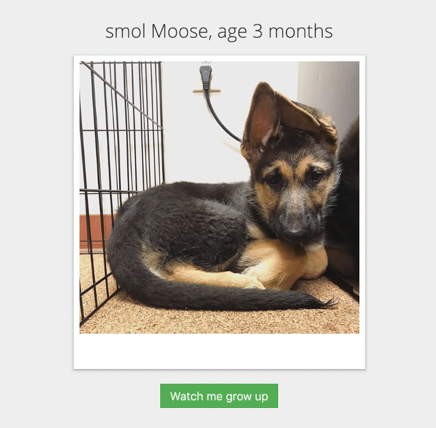

The [React Context API](https://reactjs.org/docs/context.html 'reactjs.org - Context API') is a great way to pass pieces of data around the component tree without having to pass them through each intermediate component. This allows us to reduce code duplication and make ongoing application maintenance easier.

But we can take things a step further by wrapping the context API in a [higher-order component](https://reactjs.org/docs/higher-order-components.html 'reactjs.org - Higher-order Components') to get the power of contexts while hiding the implementation details and mitigating the syntax bloat that comes with it.

This post will first demonstrate an app built without the context API or higher-order components. That will serve as the "back in my day, we had to walk 20 miles to school, uphill both ways, in the snow, barefoot" example to illustrate how rough things used to be. Then we'll add in just the context API, and finally turn it up to 11 by adding a higher-order component.

Here's what we'll set out to build. Full source code for this project can be [found on GitHub](https://github.com/jacobsowles/react-context-api-demo 'GitHub - Jacob Sowles'). Each version is in its own branch for easy comparison.



## Version 1: No Frills

---

To start with, let's create the simplest working version and not get too bogged down in optimization.

I generally write the main component first and stub out the details, then fill in the gaps after I fully understand the flow of what I'm trying to achieve. So here's the `App` component.

```jsx
class App extends PureComponent {
  constructor(props) {
    super(props);

    this.state = {
      theme: 'smol',
    };
  }

  toggleTheme = () => {
    this.setState(({ theme }) => ({
      theme: theme === 'smol' ? 'big' : 'smol',
    }));
  };

  render() {
    return (
      <div className="app">
        <ThemeIndicator theme={this.state.theme} />
        <ThemeToggle theme={this.state.theme} toggleTheme={this.toggleTheme} />
      </div>
    );
  }
}
```

The component starts out with the [smol](https://www.urbandictionary.com/define.php?term=Smol 'Urban Dictionary - Smol') theme enabled, which is passed into the `ThemeIndicator` (an image and some text) and `ThemeToggle` (a button for switching from one theme to another). The `ThemeToggle` also gets a callback function that will handle the state updates.

Now let's knock out the `ThemeIndicator` and `ThemeToggle` components.

```jsx
const ThemeIndicator = ({ theme }) => {
  return (
    <div className="theme-indicator">
      <h1>
        {theme} Moose, age {theme === 'smol' ? '3' : '6'} months
      </h1>
      
    </div>
  );
};
```

```jsx
const ThemeToggle = ({ theme, toggleTheme }) => {
  return (
    <button className="theme-toggle" onClick={toggleTheme}>
      Watch me grow{theme === 'smol' ? ' up' : '...down?'}
    </button>
  );
};
```

Not much happening here. Each component gets the theme, then uses that information to conditionally display a certain set of content.

With the pieces written this way, the project works just fine. And honestly, if the scope of a real-life project were this simple, I'd probably call it done right now, because [premature optimization is a thing](https://stackify.com/premature-optimization-evil/ 'Why Premature Optimization Is the Root of All Evil').

But let's assume we need to make use of the theme state several components deep. For example, what if the `App` component renders a `Router` component, which renders a `HomePage` component, which renders a `Timeline` component, which renders the picture? Suddenly, the loading state is managed at the highest level (`App`) but needs to be passed all the way down to the `Timeline` component so that it can programatically render the appropriate content. (In some cases, you could just maintain the state closer to where it's being used, but since themes are generally used app-wide, bubbling it up to the lowest common parent component makes the most sense.)

The act of passing down props through several levels is known as [prop drilling](https://blog.kentcdodds.com/prop-drilling-bb62e02cb691 'Kent C. Dodds - Prop Drilling') and can be a real pain. If we were to add another component somewhere in the middle of the tree, we'd need to add a prop to receive and pass on the state, even if that component doesn't actually use that state. That's a [bad code smell](https://en.wikipedia.org/wiki/Code_smell 'Wikipedia - Code Smell'). But also consider implementing type security with PropTypes or TypeScript. For every component that receives the theme state as a prop, we'd need to update the interface or propTypes object to include it. For a project this size, it's not a big deal, but it would quickly get out of hand for a larger project. So let's fix it using the React Context API.

## Version 2: Adding Context

---

First, let's create the `ThemeContext` itself.

```jsx
const ThemeContext = React.createContext({
  name: undefined,
  toggleTheme: undefined,
});

class ThemeProvider extends PureComponent {
  constructor(props) {
    super(props);

    this.state = {
      name: 'smol',
    };
  }

  toggleTheme = () => {
    this.setState(({ name }) => ({
      name: name === 'smol' ? 'big' : 'smol',
    }));
  };

  render() {
    return (
      <ThemeContext.Provider
        value={{ name: this.state.name, toggleTheme: this.toggleTheme }}
      >
        {this.props.children}
      </ThemeContext.Provider>
    );
  }
}

const ThemeConsumer = ThemeContext.Consumer;

export { ThemeProvider, ThemeConsumer };
```

There are two pieces of the context: a `Provider` and a `Consumer`. The provider is the mechanism by which the context is passed into a component, and the consumer is the mechanism by which that context is accessed.

Given that, the `ThemeProvider` does a few things. First, it takes over the theme state management responsibilies from the `App` component. This in itself is nice because of the [separation of concerns](https://en.wikipedia.org/wiki/Separation_of_concerns 'Wikipedia - Separation of Concerns'); the theme is managed by the ThemeContext rather than the App (which also handles other things not related to the theme).

But more critically, managing the theme state here allows us to pass the state into our `ThemeProvider` so that the state can be later consumed by the provider's child components.

To that end, let's update our main render call:

```jsx
import App from './components/App';
import { ThemeProvider } from './components/ThemeContext';

ReactDOM.render(
  <ThemeProvider>
    <App />
  </ThemeProvider>,
  document.getElementById('root')
);
```

By wrapping our `App` component with the `ThemeProvider`, every component within `App` will be able to use a `ThemeConsumer` to access the theme state. Like so:

```jsx
import { ThemeConsumer } from '../ThemeContext';

const ThemeIndicator = () => {
  return (
    <ThemeConsumer>
      {context => (
        <div className="theme-indicator">
          <h1>
            {context.name} Moose, age {context.name === 'smol' ? '3' : '6'}{' '}
            months
          </h1>
          
        </div>
      )}
    </ThemeConsumer>
  );
};
```

```jsx
import { ThemeConsumer } from '../ThemeContext';

const ThemeToggle = () => {
  return (
    <ThemeConsumer>
      {context => (
        <button className="theme-toggle" onClick={context.toggleTheme}>
          Watch me grow{context.name === 'smol' ? ' up' : '...down?'}
        </button>
      )}
    </ThemeConsumer>
  );
};
```

And now that those components can access the theme state via the `ThemeConsumer`, we can remove the state management from our `App` component, as well as the props being passed into the `ThemeIndicator` and `ThemeToggle`. We can also convert `App` from a `PureComponent` to a functional component since it's no longer stateful.

```jsx
const App = () => (
  <div className="app">
    <ThemeIndicator />
    <ThemeToggle />
  </div>
);
```

We've now eliminated prop drilling, and with it the hastle of creating and maintaining those "pass-through" props and type safety. We could stop here and feel pretty good about what we've accomplished. But personally, I'm still not satisfied with the level of code duplication. Every component that uses the theme state has to be wrapped in a `ThemeConsumer`. Those components are also pretty syntax-heavy due to the [render props](https://reactjs.org/docs/render-props.html 'reactjs.org - Render Props').

I don't want to have to remember or understand any of the implementation details of the `ThemeContext`. I just want to use it. It may seem trivial now, but Future You will be grateful, because Future You probably isn't going to remember building this. And your teammates will love you, because they can just use what you built without having to spend time learning about it.

So let's improve the developer ergonomics by wrapping our context in a higher-order component.

## Version 3: Adding a Higher-order Component

---

```jsx
import { ThemeConsumer } from '../components/ThemeContext';

const withTheme = Component => {
  return props => (
    <ThemeConsumer>
      {context => <Component themeContext={context} {...props} />}
    </ThemeConsumer>
  );
};
```

This surprisingly simple component is pretty powerful. It takes the nasty parts of the Context API and wraps them up into one reusable chunk by grabbing the theme context from the consumer and passing it into the supplied component, along with any additional props that component has. Now let's put this higher-order component to use.

```jsx
import withTheme from '../../withTheme';

const ThemeIndicator = ({ themeContext }) => {
  return (
    <div className="theme-indicator">
      <h1>
        {themeContext.name} Moose, age{' '}
        {themeContext.name === 'smol' ? '3' : '6'} months
      </h1>
      
    </div>
  );
};

export default withTheme(ThemeIndicator);
```

```jsx
import withTheme from '../../withTheme';

const ThemeToggle = ({ themeContext }) => {
  return (
    <button className="theme-toggle" onClick={themeContext.toggleTheme}>
      Watch me grow{themeContext.name === 'smol' ? ' up' : '...down?'}
    </button>
  );
};

export default withTheme(ThemeToggle);
```

Now the repeated `ThemeConsumer` wrappers are gone, and we don't have to deal with the render props anymore.

Future You or your teammates may wonder "Where does the `themeContext` prop come from?", but the beauty of this pattern is that **it doesn't matter**. The `themeContext` could be delivered by an [unladen swallow](https://www.youtube.com/watch?v=liIlW-ovx0Y&t=1m24s 'YouTube - Monty Python and the Holy Grail') and it wouldn't make any difference.

This pattern scales very easily as well. If another component is created and needs access to the theme, all we'd have to do is add the context prop and wrap the export with the `withTheme` function.

We could even extract our `ThemeContext` and `withTheme` components into a separate package and enable the seamless use of theme customization across different projects. That would require some upgrades to the `ThemeContext` to make it truly useful, but I'll leave that challenge to you.

## Wrapping Up

---

While this project may not be much more than a toy problem, this higher-order-component-wrapped context API pattern can be applied in a number of ways, like visual themes (light, dark, etc.), localization, routing, and more. I encourage you to give it a shot and see what you come up with.
